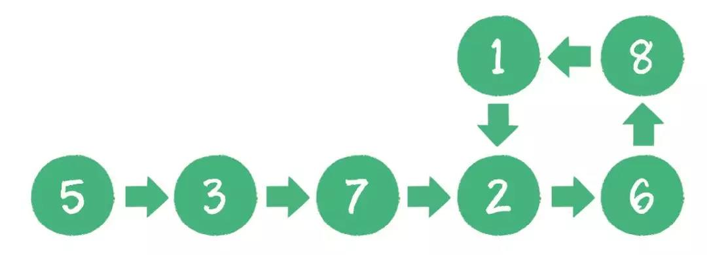

基础薄弱。

 <!-- more -->

面试时只想到了最简单的遍历方法，每遍历一个节点，都保存节点，到新节点时，从保存的节点中查找是否存在地址相同的，存在就是有环的，否则无环。问我有没有别的方法时，就想不到了。

### 有环链表



看图更直观。

```c
// 指针节点定义
struct node
{
    int val;
    struct node *next;
    node(int x) : val(x), next(NULL) {}
};
```


### 方法1

定义一个快指针和一个慢指针，慢指针一次走一步，快指针一次走两步。如果快指针追上了慢指针，则链表有环；如果快指针走到末尾也没追上慢指针，则无环。

```c
bool IsLoop(node *head)
{
    if (head == NULL)
    {
        return false;
    }

    node *slow = head->next;
    if (slow == NULL)
    {
        return false;
    }

    node *fast = slow->next;
    while (fast != NULL && slow != NULL)
    {
        if (fast == slow)
        {
            return true;
        }

        slow = slow->next;
        fast = fast->next;
        if (fast != NULL)
        {
            fast = fast->next;
        }
    }
    return false;
}
```

### 方法2

 通过使用STL库中的`map`表进行映射。首先定义 `map<node *, int> m`; 将一个 `node * `指针映射成数组的下标，并赋值为一个 `int `类型的数值。然后从链表的头指针开始往后遍历，每次遇到一个指针`p`，就判断` m[p] `是否为0。如果为0，则将`m[p]`赋值为1，表示该节点第一次访问；而如果`m[p]`的值为1，则说明这个节点已经被访问过一次了，说明链表有环。 

```c
bool IsLoop_2(node *head)
{
    map<node *, int> m;
    if (head == NULL)
    {
        return false;
    }
    node *p = head;

    while (p)
    {
        if (m[p] == 0)
        {
            m[p] = 1;
        }
        else if (m[p] == 1)
        {
            return true;
        }
        p = p->next;
    }
    return false;
}
```

### 测试

```c
#include <iostream>
#include <map>

using namespace std;

int main()
{
    //创建单链表
    node *l1 = new node(0);
    node *p = l1;
    for (int i = 1; i <= 7; i++)
    {
        p->next = new node(i);
        p = p->next;
    }

    //创建有环链表
    node *l2 = new node(0);
    p = l2;
    for (int i = 1; i <= 7; i++)
    {
        p->next = new node(i);
        p = p->next;
    }
    node *q = l2;
    for (int i = 0; i < 4; i++)
    {
        q = q->next;
    }
    p->next = q;

    //输出链表
    // q = l2;
    // while (q)
    // {
    //     cout << q->val << endl;
    //     q = q->next;
    // }

    if (IsLoop(l1))
    {
        cout << "List l1 is a cycle chain" << endl;
    }
    else 
    {
        cout << "List l1 is not a cycle chain" << endl;
    }

    if (IsLoop(l2))
    {
        cout << "List l2 is a cycle chain" << endl;
    }
    else 
    {
        cout << "List l2 is not a cycle chain" << endl;
    }

       if (IsLoop_2(l1))
    {
        cout << "List l1 is a cycle chain" << endl;
    }
    else 
    {
        cout << "List l1 is not a cycle chain" << endl;
    }

    if (IsLoop_2(l2))
    {
        cout << "List l2 is a cycle chain" << endl;
    }
    else 
    {
        cout << "List l2 is not a cycle chain" << endl;
    }

    system("pause");
    return 0;
}
```

```c
// 结果
List l1 is not a cycle chain
List l2 is a cycle chain
List l1 is not a cycle chain
List l2 is a cycle chain
```

### 参考

[1] [如何判断链表有环]( https://www.cnblogs.com/cone/p/11257063.html )

[2] [判断一个单链表是否有环，若有，找出环的入口节点](https://www.cnblogs.com/xiaodi914/p/5795096.html)

