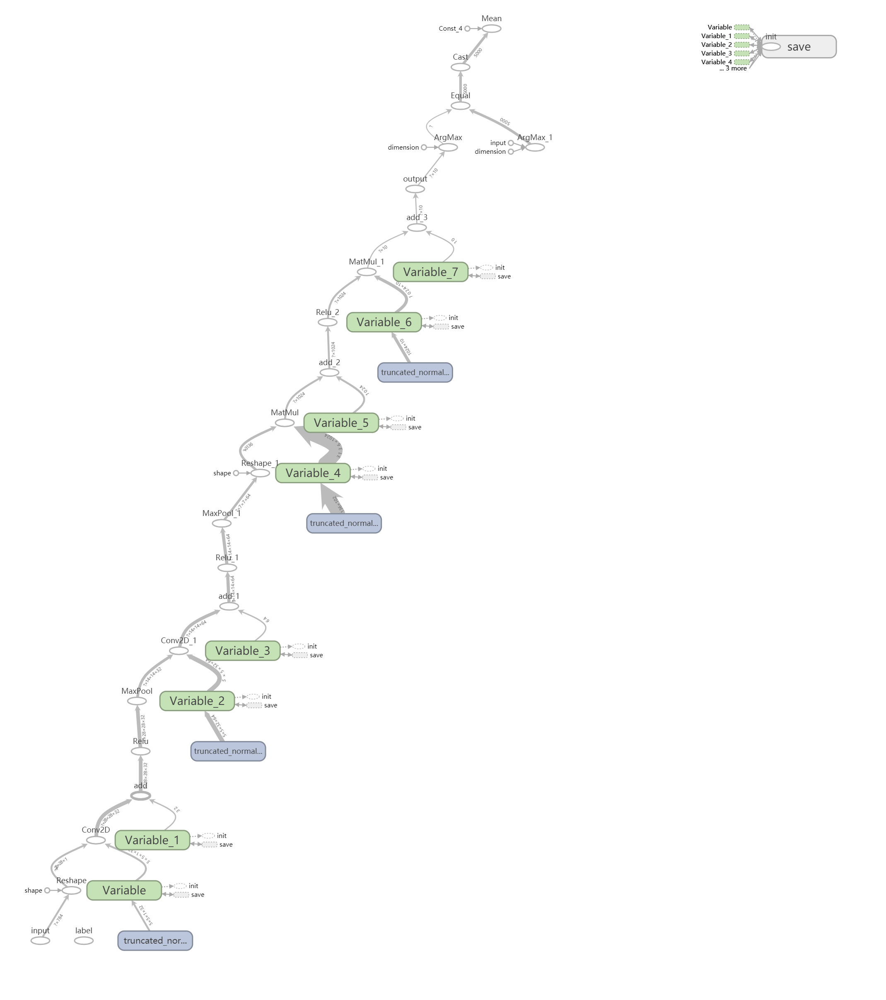
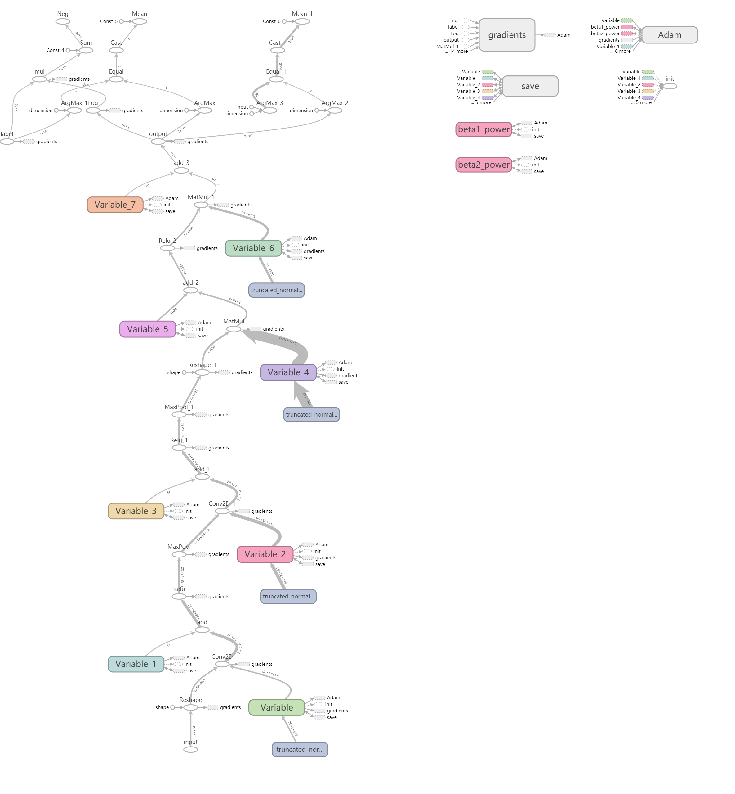
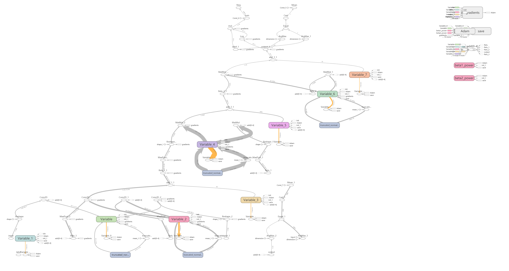

代码地址：[查看完整代码](https://github.com/Junyuan12/Tensorflow1.x_save_and_load_model)

<!-- more -->

#### 一个错误的使用

之前有同学问过我这个问题，`TF`加载模型，跑出来的结果不对，代码见`incurrect_usage.py`，正确率和猜的一样，怀疑是模型加载那里出问题了。

```python
#****************** incurrent usage.py*********************
x = tf.placeholder(tf.float32, [None, 784], name="input")
y_ = tf.placeholder(tf.float32, [None, 10], name="label")
pred = forward(x)

with tf.Session() as sess:
    sess.run(tf.global_variables_initializer())
    saver = tf.train.import_meta_graph('./model/mnist_model-4000.meta')
    saver.restore(sess, './model/mnist_model-4000')
    correct_prediction = tf.equal(tf.argmax(pred,1), tf.argmax(test_label, 1))
    accuracy = tf.reduce_mean(tf.cast(correct_prediction, "float"))
    acc = sess.run(accuracy, feed_dict={x: test_image, y_: test_label})
```

跑出来的正确率都在0.1左右，训练正确率都在0.9以上，再差也不会这样，所以加载模型哪里出错了。

#### Tensorflow加载模型的方法

本例使用`tf.train.Saver()`保存模型的方法，执行`saver.save(sess, model_name)`后，会得到3个名为`model_name`的文件，`.data-00000-of-00001`中保存了网络训练的参数，`.meta`保存了网络的图结构。

`Tensorflow`在加载模型的时候就需要上述的两个东西，网络参数和图结构，而加载图有两种方式，**重新搭建网络**或**直接用.meta**文件。

#### 重新搭建网络

顾名思义，在测试代码中重新把训练时`forward`的流程再搭一遍，这样就能得到由训练好的参数得到`forward`的结果。

```python
#****************** test with network.py*********************
x = tf.placeholder(tf.float32, [None, 784], name="input")
y_ = tf.placeholder(tf.float32, [None, 10], name="label")
pred = forward(x)

with tf.Session() as sess:
    sess.run(tf.global_variables_initializer())
    saver = tf.train.Saver()
    saver.restore(sess, './model/mnist_model-4000')
    correct_prediction = tf.equal(tf.argmax(pred,1), tf.argmax(test_label, 1))
    accuracy = tf.reduce_mean(tf.cast(correct_prediction, "float"))
    acc = sess.run(accuracy, feed_dict={x: test_image, y_: test_label})
```

因为`forward`流程和训练时一样，所以直接在训练代码里拿来用，已经重新搭建了图，就不要加载`.meta`文件了，所以直接`restore`参数文件就可以了。

拿测试集中前5000个样本做测试，测试结果：

```
test with network: 
INFO:tensorflow:Restoring parameters from ./model/mnist_model-4000
accuracy is:  0.9784
```

网络结构：



#### 使用.meta文件构建图

使用`.meta`文件需要注意，在训练时最好为输入和输出取一个名字，因为需要直接从`.meta`保存的图结构中取输入和输出，有名字的时候会更明确一些。

像这样：

```python
x = tf.placeholder(tf.float32, [None, 784], name="input")
y_ = tf.placeholder(tf.float32, [None, 10], name="label")
```

加载`.meta`代码如下：

```python
#****************** test with meta.py*********************
with tf.Session() as sess:
    saver = tf.train.import_meta_graph('./model/mnist_model-4000.meta')
    saver.restore(sess, tf.train.latest_checkpoint("./model/"))
    
    graph = tf.get_default_graph()
    input_x = graph.get_operation_by_name("input").outputs[0]
    feed_dict = {"input:0":test_image, "label:0":test_label}
    pred = graph.get_tensor_by_name("output:0")
    correct_prediction = tf.equal(tf.argmax(pred, 1), tf.argmax(test_label, 1))
    accuracy = tf.reduce_mean(tf.cast(correct_prediction, "float"))
    acc = sess.run(accuracy, feed_dict=feed_dict)
```

使用`.meta`文件，直接根据名字找到对应的输出和输出，获取默认图结构，不需要重新初始化参数。

拿测试集中前5000个样本做测试，测试结果：

```python
test with .meta:
INFO:tensorflow:Restoring parameters from ./model/mnist_model-4000
accuracy is:  0.9784
```

测试结果和重新构建网络是一样的。

网络结构：



使用`.meta`测试时，网络输出那里出现了两个分支，猜测是`.meta`保存了训练时测试`accuracy`那部分图，我在测试的代码里又写了一个测试`accuracy`的部分，所以两部分都被保存了，但不影响测试的结果。

#### 错误的原因

很容易猜到，图加载了两次，已经重建网络了，然后又加载了`.meta`，导致图的结构乱了，看图：



网络的结构已经变了，所以加载训练好的模型时，要么重建图，要么加载`.meta`，混合起来就容易出错。

TODO：使用滑动平均如何加载模型

#### 参考

Mnist网络backbone：[点击前往](https://www.cnblogs.com/willnote/p/6874699.html)

TF加载模型方法： [点击前往](https://blog.csdn.net/sjtuxx_lee/article/details/82663394)