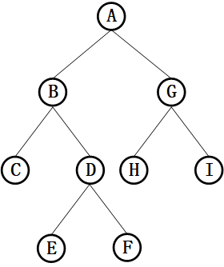

莫名其妙，可能这就是生活的意义。

 <!-- more -->

还是昨天面试的问题，问完栈和队列，说栈和队列的应用，当时就想起了括号的匹配，，没想到二叉树的深度遍历和广度遍历，这两种遍历方式分别对应的就是栈和队列的一个应用。

### 1. 深度优先遍历

#### 1.1 定义

深度优先遍历：对每一个可能的分支路径深入到不能再深入为止，而且每个结点只能访问一次。深度优先遍历可以细分为先序遍历、中序遍历、后序遍历。具体说明如下：

+ 先序遍历：对任一子树，先访问根，然后遍历其左子树，最后遍历其右子树。
+ 中序遍历：对任一子树，先遍历其左子树，然后访问根，最后遍历其右子树。
+ 后序遍历：对任一子树，先遍历其左子树，然后遍历其右子树，最后访问根。

#### 1.2 实现

 因为深度优先搜索算法是先访问根节点，接着遍历左子树再遍历右子树。因为栈是**后进先出**的结构，先将**右子树压栈，再将左子树压栈**，这样左子树就位于栈顶，可以保证先遍历左子树再遍历右子树。 

```c
void depthFirstTravel(Node* root){
    stack<Node *> nodeStack; 
    nodeStack.push(root);
    Node *node;
    while(!nodeStack.empty()){
        node = nodeStack.top();
        cout << node->key << endl;
        nodeStack.pop();
        if(node->rchild){
            nodeStack.push(node->rchild);
        }
        if(node->lchild){
            nodeStack.push(node->lchild);
        }
    }
}
```

### 2. 广度优先遍历

#### 2.1 定义

 从根节点开始，沿着树的宽度遍历树的节点，直到所有节点都被遍历完为止。 

#### 2.2 实现

因为是一层一层遍历的，所以使用**队列**这种数据结构，先将一层节点放到队列中，当遍历完当前这一层后，再分别出队列，同时遍历当前节点的子节点，达到一层一层遍历的目的。若使用**栈**，压入第二层时，出栈就无法按照正常顺序输出了。你品，你细品。

```c
void breadthFirstTravel(Node* root){
queue<Node *> nodeQueue;
    nodeQueue.push(root);
    Node *node;
    while(!nodeQueue.empty()){
        node = nodeQueue.front();
        nodeQueue.pop();
        cout << node->key << endl;
        if(node->lchild){
            nodeQueue.push(node->lchild);
        }
        if(node->rchild){
            nodeQueue.push(node->rchild);
        }
    }
}
```

### 3. 完整实现

以下图的二叉树为例。



二叉树节点定义：

```c
struct STreeNode
{
    char key;
    pSTreeNode lchild;
    pSTreeNode rchild;

    STreeNode(char Value)
    {
        key = Value;
        lchild = NULL;
        rchild = NULL;
    }
};
```

```c
#include <iostream>
#include <stack>
#include <queue>

using namespace std;

int main()
{
    Node *root = new Node('A');
    root->lchild = new Node('B');
    root->rchild = new Node('G');
    Node *p = root->lchild;
    Node *q = root->rchild;
    p->lchild = new Node('C');
    p->rchild = new Node('D');
    p = p->rchild;
    p->lchild = new Node('E');
    p->rchild = new Node('F');
    q->lchild = new Node('H');
    q->rchild = new Node('I');
    cout << "depthFirstTravel is: " << endl;
    depthFirstTravel(root);
    cout << endl;
    cout << "breadthFirstTravel is: " << endl;
    breadthFirstTravel(root);
    cout << endl;
    system("pause");
    return 0;
}

// 结果
// depthFirstTravel is:
// A B C D E F G H I
// breadthFirstTravel is:
// A B G C D H I E F
```


### 参考

[1] [二叉树的深度遍历和广度遍历]( https://www.jianshu.com/p/62f186bae583 )

[2] [二叉树的深度优先遍历和广度优先遍历]( https://blog.csdn.net/Fantasy_Lin_/article/details/52751559 )

 