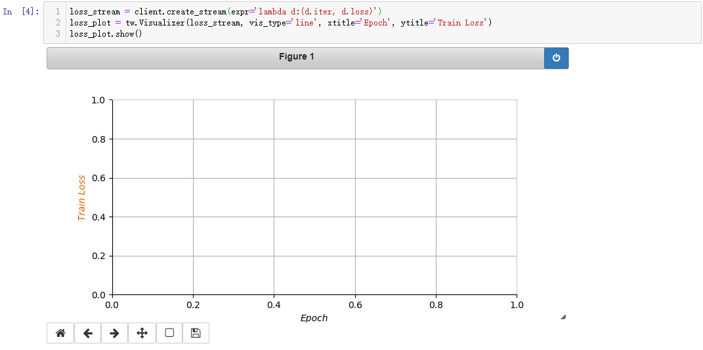
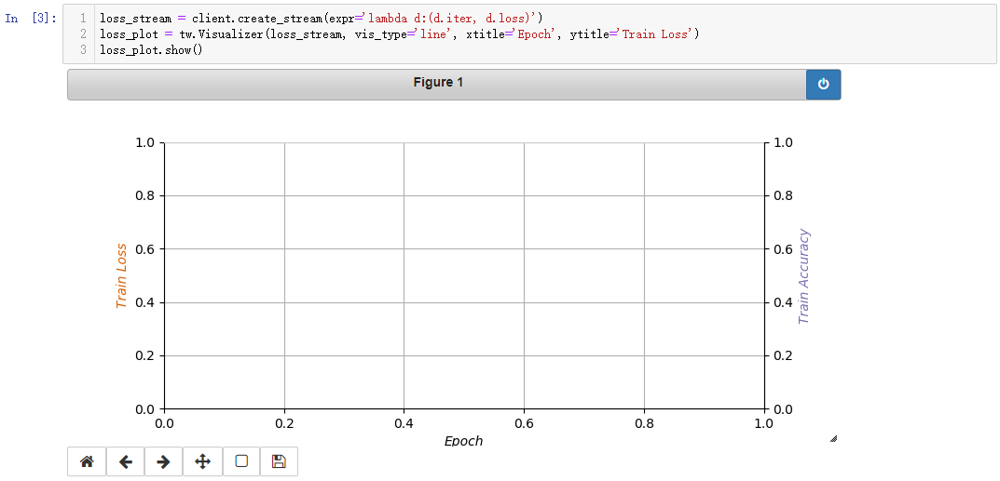
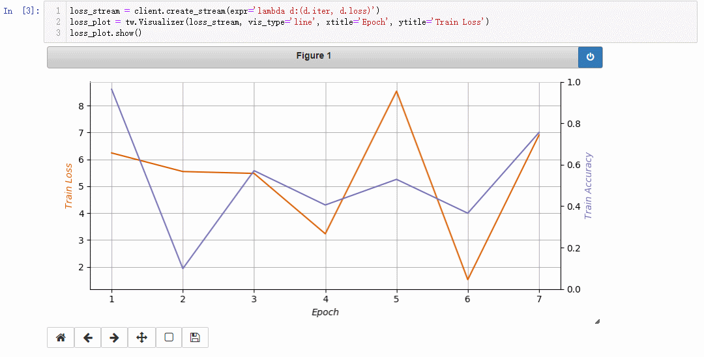

tensorwatch地址：[Github](https://github.com/microsoft/tensorwatch)

<!-- more -->

> TensorWatch is a debugging and visualization tool designed for deep learning and reinforcement learning. It fully leverages Jupyter Notebook to show real time visualizations and offers unique capabilities to query the live training process without having to sprinkle logging statements all over. You can also use TensorWatch to build your own UIs and dashboards. In addition, TensorWatch leverages several excellent libraries for visualizing model graph, review model statistics, explain prediction and so on.

Tensorwatch可以在网络训练的过程中可视化网络的损失以及各种参数，相比于print，能看的更直观一些，而且，看着很高端啊。

通过`pip`安装`tensorwatch`：

```
pip install tensorwatch
```

中间可能会在安装pytorch那里报错，只需要单独把torch装一下就行。话说这个东西为什么会和pytorch挂钩，而且，Anaconda的清华源已经不能用了啊！！！

然后就是动态显示的过程了，这里官方文档说的不是很具体，走了不少弯路。

`tensorwatch`只是一个可视化的工具，不会产生任何数据，都是从执行代码的终端那里来的，都是从执行代码的终端那里来的，都是从执行代码的终端那里来的。

所以，首先要有产生数据的终端：

```python
#***************** gen_data.py *******************
import time
import tensorwatch as tw
import random

# create watcher, notice that we are not logging anything
w = tw.Watcher()

for i in range(10000):
    x = i
    loss = random.random() * 10
    train_accuracy = random.random()

    # we are just observing variables
    # observation has no cost, nothing gets logged anywhere
    w.observe(iter=x, loss=loss, train_accuracy=train_accuracy)

    time.sleep(1)
```

通过`tw.Watcher()`创建一个观察的对象，将要可视化的数据放在`observe`中，这里假设是个神经网络，`x`代表迭代的次数，`loss`代表每次迭代后的损失，`train_accuracy`代表每次迭代后在训练集上的准确率。

到这里，生成数据的终端就完成了，下一步，在`jupyter notebook`中可视化每一步的结果。

打开`jupyter notebook`，新建一个`notebook`

```python
%matplotlib notebook
import tensorwatch as tw
```

```python
# 连接执行tensorwatch的终端
client = tw.WatcherClient()
```

```python
# 使用lambda获取终端中的参数
loss_stream = client.create_stream(expr='lambda d:(d.iter, d.loss)')
# 可视化设置
loss_plot = tw.Visualizer(loss_stream, vis_type='line', xtitle='Epoch', ytitle='Train Loss')
loss_plot.show()
```

执行完上面的代码会生成一个可视化的界面，用来表示迭代次数和损失之间的关系：



继续执行，用以表示迭代次数和训练的正确率之间的关系：

```python
acc_stream = client.create_stream(expr='lambda d:(d.iter, d.train_accuracy)')
acc_plot = tw.Visualizer(acc_stream, vis_type='line', host=loss_plot, xtitle='Epoch', ytitle='Train Accuracy', yrange=(0,))
acc_plot.show()
```

执行完Figure会变成下图的样子：



**注意在终端执行完之前不要关闭figure，否则可视化就结束了。**

最后新建一个终端，在终端中执行：

```
python gen_data.py
```

就可以在`jupyter notebook`中可视化结果啦。



至此，可视化的任务就结束了。

拿`Tensorflow`做了一个简单的测试，可视化的参数和上面`jupyter notebook`中的相同，只需要将终端中执行的`gen_data.py`换成`mnist_train.py`就可以了。

```python
#***************** mnist_train.py *******************
# -*- coding: utf-8 -*-
import tensorflow as tf
from tensorflow.examples.tutorials.mnist import input_data
import tensorwatch as tw

def weight_variable(shape):
    initial = tf.truncated_normal(shape, stddev=0.1)
    return tf.Variable(initial)

def bias_variable(shape):
    initial = tf.constant(0.1, shape=shape)
    return tf.Variable(initial)

def conv2d(x, W):
    return tf.nn.conv2d(x, W, strides=[1, 1, 1, 1], padding='SAME')

def max_pool_2x2(x):
    return tf.nn.max_pool(x, ksize=[1, 2, 2, 1], strides=[1, 2, 2, 1], padding='SAME')

def forward(x):
    # convolution layer 1
    W_conv1 = weight_variable([5, 5, 1, 32])
    b_conv1 = bias_variable([32])
    
    x_image = tf.reshape(x, [-1, 28, 28, 1])
    
    h_conv1 = tf.nn.relu(conv2d(x_image, W_conv1) + b_conv1)
    h_pool1 = max_pool_2x2(h_conv1)
    
    # convolution layer 2
    W_conv2 = weight_variable([5, 5, 32, 64])
    b_conv2 = bias_variable([64])
    
    h_conv2 = tf.nn.relu(conv2d(h_pool1, W_conv2) + b_conv2)
    h_pool2 = max_pool_2x2(h_conv2)
    
    # full convolution
    W_fc1 = weight_variable([7 * 7 * 64, 1024])
    b_fc1 = bias_variable([1024])
    
    h_pool2_flat = tf.reshape(h_pool2, [-1, 7*7*64])
    h_fc1 = tf.nn.relu(tf.matmul(h_pool2_flat, W_fc1) + b_fc1)
    
    # output layer, softmax
    W_fc2 = weight_variable([1024, 10])
    b_fc2 = bias_variable([10])
    
    y_conv=tf.nn.softmax(tf.matmul(h_fc1, W_fc2) + b_fc2, name="output")
    
    return y_conv

def train():
    mnist = input_data.read_data_sets("/MNIST_data", one_hot=True)
    
    w = tw.Watcher()

    x = tf.placeholder(tf.float32, [None, 784], name="input")
    y_ = tf.placeholder(tf.float32, [None, 10], name="label")
    
    y_conv = forward(x)
    cost = -tf.reduce_sum(y_*tf.log(y_conv))
    train_step = tf.train.AdamOptimizer(1e-4).minimize(cost)
    correct_prediction = tf.equal(tf.argmax(y_conv,1), tf.argmax(y_,1))
    accuracy = tf.reduce_mean(tf.cast(correct_prediction, "float"))
    
    with tf.Session() as sess:
        sess.run(tf.global_variables_initializer())
        
        for i in range(5000):
            batch = mnist.train.next_batch(64)
            _, loss = sess.run([train_step, cost], feed_dict={x: batch[0], y_: batch[1]})
            
            if i%100 == 0:
                train_accuracy = sess.run(accuracy, feed_dict={x:batch[0], y_: batch[1]})
                print("step %d, training accuracy %g"%(i, train_accuracy))

            w.observe(iter=i, loss=loss, train_accuracy=train_accuracy)

if __name__ == "__main__":
	train()
```

