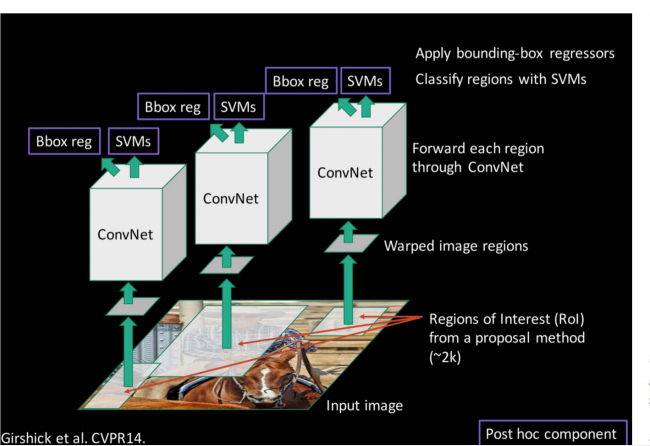
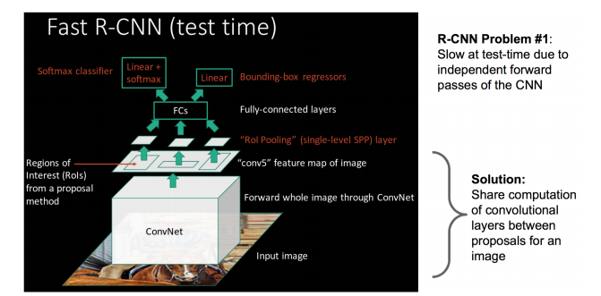

`Faster RCNN`是为目标检测而提出的一种网络，目标检测的任务是从一张给定的图片中不仅要对图像中的物体进行分类，而且要为每个类别的物体加一个`Box`，也就是要确定检测到的物体的位置。

 <!-- more -->

### 阅读前准备

`Faster RCNN`由`Fast RCNN`改进，所以简单了解`RCNN`和`Fast RCNN`。

#### RCNN
`RCNN`使用`selective search`方法，为每张图片提出大概1k~2k个候选区域，然后将每个候选区域都输入到网络中，进行特征提取，之后输入到一个SVM分类器中判断物体类别，最后使用一个回归器得到物体的精确位置，即`Box`。通过简单描述就可以看出，`RCNN`的缺点非常明显，对于现在的网络，基本都是端到端的结构，而`RCNN`的处理流程很复杂，并且保存每个候选区域的特征也会占用非常多的空间；其二，对这么多的候选区域，计算会浪费非常多的时间，而且提取的特征会重复。


#### Fast RCNN
`Fast RCNN`作为`RCNN`的进阶版，主要改进在两方面，一个是只需要对输入图像提一次特征，然后将找到候选区域对应的特征，对特征进行分类和回归得到`Box`；另一方面是`ROI Pooling`，由于网络中全连接层的存在，所以要求网络所谓输入大小必须是相同的，但`selective search`选出的候选区域大小不同，如果直接将输入图像都缩放到相同的大小，会丢失图像的信息；通过`ROI Pooling`可以解决这个问题，相比较于`Max Pooling`固定的`stride`，`ROI Pooling`的`stride`是根据输出的大小来决定的，比如当前`ROI feature map`的大小为$h \times w$，经过`ROI Pooling`后输出的固定大小为$H \times W$，那么`ROI Pooling`的`stride`就是$\frac{h}{H} \times \frac{w}{W}$。


### Faster RCNN
#### 论文核心
> we introduce a Region Proposal Network (RPN) that shares full-image convolutional features with the detection network, thus enabling nearly cost-free region proposals. 

论文中提出一种新的选择`Region proposals`的方法，用`RPN`代替`Fast RCNN`中`Selective search`，`RPN`与`object detection network`共享卷积层，节省了大量选择候选区域的时间，`SS` $2s$ per image, `RPN` $10ms$ per image。
#### Anchor
> RPNs are designed to efficiently predict region proposals with a wide range of scales and aspect ratios.  

提出了`anchor `做多尺度和长宽比的参考，避免了枚举多个尺度的信息。

`anchor`的[实现过程](https://blog.csdn.net/sinat_33486980/article/details/81099093)：

对一幅图像，经过网络下采样得到`feature map`，对`feature map`中的一个点，找到其在原始图形对应的区域，比如，一幅图像经过3次`Pooling`，那么得到的特征中的一个点对应原始图像就是一个$16 \times 16$ 的区域，对这个区域生成不同`anchor`。

首先对该区域生成3种长宽比的`anchor`（$ratios=[0.5,1,2]$）：

```python
def _whctrs(anchor):
    """
    Return width, height, x center, and y center of an anchor.
    """
    w = anchor[2] - anchor[0] + 1
    h = anchor[3] - anchor[1] + 1
    x_ctr = anchor[0] + 0.5 * (w - 1)
    y_ctr = anchor[1] + 0.5 * (h - 1)
    return w, h, x_ctr, y_ctr
    
```

```python
def _mkanchors(ws, hs, x_ctr, y_ctr):   
    """ 
    Getting coordinates of different window width ratios around the same center.
    
    Parameters:
        ws : A sist of X coordinates in the upper left corner of a anchor.
        hs : A sist of Y coordinates in the upper left corner of a anchor.
        x_ctr : X-coordinates of the center of a anchor.
        y_ctr : Y-coordinates of the center of a anchor.
    Return:
        anchors : Coordinates with different aspect ratios.
    """  
    ws = ws[:, np.newaxis]
    hs = hs[:, np.newaxis]  
    anchors = np.hstack((x_ctr - 0.5 * (ws - 1),
                         y_ctr - 0.5 * (hs - 1),
                         x_ctr + 0.5 * (ws - 1),
                         y_ctr + 0.5 * (hs - 1)))
    return anchors
```

```python
def _ratio_enum(anchor, ratios):
    '''
    Enumerate a set of anchors for each aspect ratio wrt an anchor.
    
    Parameters:
        anchor : A list contains coordinates of the upper left and lower right corners.
        ratios : A list contains different aspect ratios.
    Return:
        anchors : Coordinates with different aspect ratios.
    '''
    w, h, x_ctr, y_ctr = _whctrs(anchor)
    size = w * h                            #size:16*16=256
    size_ratios = size / np.array(ratios)   #256/ratios[0.5,1,2]=[512,256,128]
    ws = np.round(np.sqrt(size_ratios))     #ws:[23 16 11]
    hs = np.round(ws * ratios)              #hs:[12 16 22]

    anchors = _mkanchors(ws, hs, x_ctr, y_ctr)  
    
    return anchors
```

运行结果，得到同一中心3个长宽比的`anchor`：

```python
_ratio_enum([0, 0, 15, 15], [0.5, 1, 2])

array([[-3.5,  2. , 18.5, 13. ],
       [ 0. ,  0. , 15. , 15. ],
       [ 2.5, -3. , 12.5, 18. ]])
```

然后对每个长宽比的`anchor`进行3种面积变换（$scales=[8, 16, 32]$）：

```python
def _scale_enum(anchor, scales):
    """
    Enumerate a set of anchors for each scale wrt an anchor.
    
    Parameters:
        anchor : Orginal anchor.
        scales : Scaling factor.
    Return:
        Scaled coordinates of anchor.
    """
    w, h, x_ctr, y_ctr = _whctrs(anchor)
    ws = w * scales
    hs = h * scales
    anchors = _mkanchors(ws, hs, x_ctr, y_ctr)
    return anchors
```

运行结果，得到1个特征点对应的不同长宽比和不同缩放系数对应的9个`anchor`：

```python
scales = 2**np.arange(3, 6) #[8, 16, 32]
#别问我里为什么是15不是16，我也在研究
ratio_anchors = _ratio_enum([0,0,15,15], [0.5, 1, 2])
np.vstack([_scale_enum(ratio_anchors[i, :], scales)
                        for i in range(ratio_anchors.shape[0])])

array([[ -84.,  -40.,   99.,   55.],
       [-176.,  -88.,  191.,  103.],
       [-360., -184.,  375.,  199.],
       [ -56.,  -56.,   71.,   71.],
       [-120., -120.,  135.,  135.],
       [-248., -248.,  263.,  263.],
       [ -36.,  -80.,   51.,   95.],
       [ -80., -168.,   95.,  183.],
       [-168., -344.,  183.,  359.]])
```
下面这个表格对比了9种尺寸的anchor的变换：


得到的`anchor`如下图所示，蓝色点代表`feature map`中的特征点，每种颜色框代表一种长宽比，同一颜色不同大小的矩形框代表不同的尺度：

手贱就想画图，结果就被自己蠢到了。

**`plt`画矩形的默认坐标系大小都是1，所以想画大一点的矩形，一定要先设置坐标系的大小**

我一度以为我发现了`matplotlib`的`BUG`😫😫😫

附代码：

```python
import matplotlib.pyplot as plt
colors = ["red", "blue", "green"]
fig = plt.figure(figsize=(10, 10))
ax = fig.add_subplot(1,1,1)
plt.xlim((-500, 500))	#设置x轴的大小
plt.ylim((-500, 500))	#设置y轴的大小
plt.scatter(7.5, 7.5)
for i in range(9):
    rect = plt.Rectangle((anchors[i][0], anchors[i][1] + anchors[i][3] - anchors[i][1]), 
    					anchors[i][2] - anchors[i][0], anchors[i][1] - anchors[i][3], 
    					fill=False, edgecolor = colors[i//3],linewidth=2)
    ax.add_patch(rect)
plt.show()
```

#### Region proposal Network
> Faster R-CNN is composed of two modules. The first module is a deep fully convolutional network that proposes regions, and the second module is the Fast R-CNN detector that uses the proposed regions.  

`Faster R-CNN`由两部分组成，一部分是是`Region proposal network`，突出用于检测的候选区域，另一部分和`Fast RCNN`一样，对候选区域进行检测，输出目标的类别和框的位置，网络结构如图：

这里我理解就是在网络提完特征后再加一层，用于选出候选区域。


对卷积得到的 $H\times W$ 的`feature map`，用一个 $n \times n$ 的滑动窗口对每个窗口的中心点提$k$个`anchors`，取3个长宽比，3个缩放比，即$k=9$，对该`feature map`，会生成 $k \times H \times W$ 个`anchors` ，对每个`anchor`的 $cls$ 分支，用一个 $score$ 判断这个`anchor`是前景还是背景，所以 $score$ 的数量是 $2k$ ；对 $reg$ 分支，需要判断框的位置，所以保存每个`anchor`的位置信息（左下和右上的坐标，**这里有歧义，好多博客里写的都是左上右下，但实际画图第一个点是左下的坐标**），所以 $coordinates$ 的数量是 $4k$ 。

#### 相比于SS，RPN的优势
上面说过`anchor`，用`anchor`的话，就相当于，先知道大致位置，再知道具体位置，举个例子，`anchor`就是先上这个区域看一眼是啥，比如一个`anchor`区域里看见了一个马身子（马头一部分不在区域里面），然后再看到的马身子猜测一下这个物体的位置。但穷举搜索就不是，马身子的这个区域不是一个马的区域，必须得去搜索这个区域，直到这个区域包含整个马。
`rpn`的优点就是你能用神经网络去从一个图像区域拟合出目标的位置来，这在非神经网络方法上肯定不能用。因为神经网络是一个复杂的非线性函数，传统的方法并不能轻易的做出复杂函数来。虽然传统的方法也能拟合复杂函数，如`svm`。不过传统方法很多都是模板匹配类的方法，只能记住训练图片中的整体特征。
神经网络是层级特征提取的，在图像上更加符合特点。例如识别自行车，`svm`方法就是把训练图像的自行车都记住 如果新来一辆车，和这些特点不太相同，`svm`就挂了。但神经网络不同，方式倾向于训练出车把和车轮子等的检测器，再对部件进行组合。所以`rpn`中训练的东西就是一些根据底层得到的部件检测器推测物体位置的一个函数。
以上内容来自于老师给我的讲解，看完了也就能理解的差不多了，`RPN`的作用更像是人的感觉一样的网络，这么说可能不太合适，比如看一辆自行车，人可能只看到一部分，前轮或后轮，就能知道这是一辆自行车了，而`RPN`的作用正是如此，所以`RPN`可以选出更少的`region proposal`而且更加准确，`anchor`是在选好`region proposal`的基础上，用不同长宽比的不同尺度能去尽量的把这个物体包进去。

#### Share features
采用4步交替训练的方法：
1. 用一个`ImageNet`预训练模型对RPN网络做`finetune`（RPN的作用在上面说过，这里`finetune`的目的是为了生成更好的`region proposal`）；
2. 用第一步得到的`region proposal`单独的训练一个`Fast RCNN`（`Fast RCNN`的参数也由`ImageNet`的与训练模型初始化，但这里不共享参数）；
3. 使用第2步训练好的`Fast RCNN`模型做预训练模型，固定`RPN`层以外的参数，只对`RPN`层做`finetune`，这里已经开始共享卷积层了；
4. 最后一步，固定共享卷积层的参数，对`fast RCNN`部分做`finetune`，至此，整个`faster RCNN`训练完成。